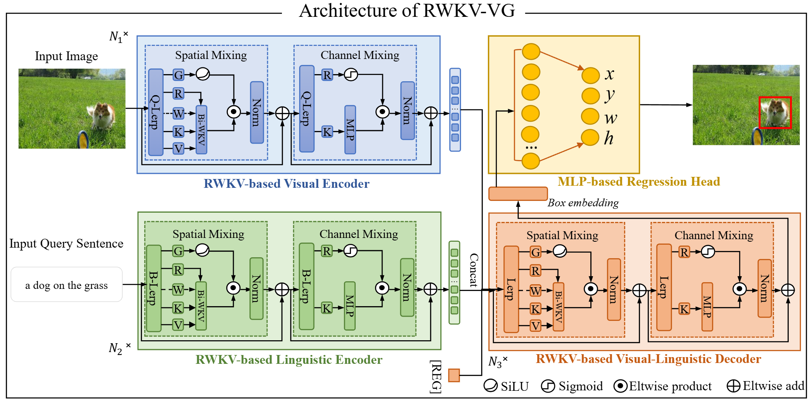

# RWKV-VG
<p align="center">  </p>

This is the official implementation of [**RWKV-VG: Visual Grounding with RWKV-driven Encoder-Decoder Framework**]. 

### Getting Started

Please refer to [GETTING_STARGTED.md](docs/GETTING_STARTED.md) to learn how to prepare the datasets and pretrained checkpoints.

### Results

<table border="2">
    <thead>
        <tr>
            <th colspan=1> </th>
            <th colspan=3> &nbsp&nbsp&nbsp&nbsp&nbsp&nbsp&nbsp RefCOCO </th>
            <th colspan=3> &nbsp&nbsp&nbsp&nbsp&nbsp&nbsp&nbsp RefCOCO+</th>
            <th colspan=3> &nbsp&nbsp&nbsp&nbsp&nbsp&nbsp&nbsp RefCOCOg</th>
            <th colspan=2> ReferItGame</th>
        </tr>
    </thead>
    <tbody>
    <tr>    
            <td> </td>
            <td>val</td>
            <td>testA</td>
            <td>testB</td>
            <td>val</td>
            <td>testA</td>
            <td>testB</td>
            <td>g-val</td>
            <td>u-val</td>
            <td>u-test</td>
            <td>val</td>
            <td>test</td>
        </tr>
    </tbody>
    <tbody>
    <tr>
            <td> RWKV-VG </td>
            <td>82.45</td>
            <td>85.13</td>
            <td>77.41</td>
            <td>66.20</td>
            <td>72.60</td>
            <td>57.25</td>
            <td>68.71</td>
            <td>69.08</td>
            <td>69.85</td>
            <td>73.21</td>
            <td>70.95</td>
        </tr>
    </tbody>
</table>


### Training and Evaluation

1.  Training
    ```
    export CUDA_VISIBLE_DEVICES=0
```
# # ReferItGame
python -m torch.distributed.launch --nproc_per_node=1 --use_env train.py --batch_size 24 --lr_bert 0.00001 --aug_crop --aug_scale --aug_translate  --dataset referit --max_query_len 20 --output_dir outputs/referit_r50
```
```
# # RefCOCO
python -m torch.distributed.launch --nproc_per_node=1 --use_env train.py --batch_size 24 --lr_bert 0.00001 --aug_crop --aug_scale --aug_translate  --dataset unc --max_query_len 20 --output_dir outputs/refcoco

```
```
# # RefCOCO+
python -m torch.distributed.launch --nproc_per_node=1 --use_env train.py --batch_size 24 --lr_bert 0.00001 --aug_crop --aug_scale --aug_translate  --dataset unc+ --max_query_len 20 --output_dir outputs/refcoco_plus
```
```
# # RefCOCOg g-split
python -m torch.distributed.launch --nproc_per_node=1 --use_env train.py --batch_size 24 --lr_bert 0.00001 --aug_scale --aug_translate --aug_crop  --dataset gref --max_query_len 40 --output_dir outputs/refcocog_gsplit
```
```
# # RefCOCOg umd-split
python -m torch.distributed.launch --nproc_per_node=1 --use_env train.py --batch_size 24 --lr_bert 0.00001 --aug_scale --aug_translate --aug_crop  --dataset gref_umd --max_query_len 40 --output_dir outputs/refcocog_usplit
```
    

    We recommend to set --max_query_len 40 for RefCOCOg, and --max_query_len 20 for other datasets. 
    

2.  Evaluation
    ```
    export CUDA_VISIBLE_DEVICES=0
```
# ReferItGame
python -m torch.distributed.launch --nproc_per_node=1 --use_env eval.py --batch_size 32 --num_workers 4  --dataset referit --max_query_len 20 --eval_set test --eval_model ./released_models/TransVG_referitV3-startHead.pth --output_dir ./outputs/referit
```
```
# # RefCOCO
python -m torch.distributed.launch --nproc_per_node=1 --use_env eval.py --batch_size 32 --num_workers 4  --dataset unc --max_query_len 20 --eval_set testB --eval_model ./released_models/RWKV_UNC.pth --output_dir ./outputs/refcoco
```
```
# # RefCOCO+
python -m torch.distributed.launch --nproc_per_node=1 --use_env eval.py --batch_size 32 --num_workers 4  --dataset unc+ --max_query_len 20 --eval_set testB --eval_model ./released_models/RWKV_UNC_PLUS.pth --output_dir ./outputs/refcoco_plus
```
```
# # RefCOCOg g-split
python -m torch.distributed.launch --nproc_per_node=1 --use_env eval.py --batch_size 32 --num_workers 4  --dataset gref --max_query_len 40 --eval_set val --eval_model ./released_models/TransVG_gref.pth --output_dir ./outputs/refcocog_gsplit
```
```
# # RefCOCOg u-split
python -m torch.distributed.launch --nproc_per_node=1 --use_env eval.py --batch_size 32 --num_workers 4  --dataset gref_umd --max_query_len 40 --eval_set test --eval_model ./released_models/RWKV-usplit.pth --output_dir ./outputs/refcocog_usplit
```
### Acknowledge
This codebase is partially based on [TransVG](https://github.com/djiajunustc/TransVG) and [RWKV-CLIP](https://github.com/deepglint/RWKV-CLIP).
