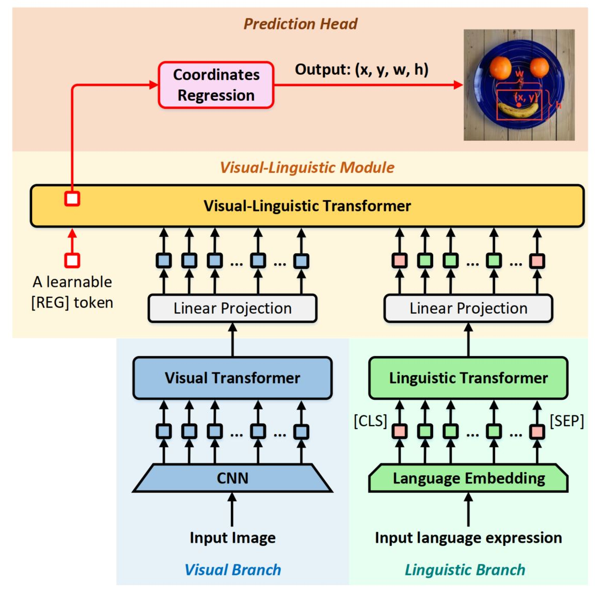

# TransVG
<p align="center">  </p>

This is the official implementation of [**RWKV-VG: Visual Grounding with RWKV-driven Encoder-Decoder Framework**]. 

### Getting Started

Please refer to [GETTING_STARGTED.md](docs/GETTING_STARTED.md) to learn how to prepare the datasets and pretrained checkpoints.

### Model Zoo

<table border="2">
    <thead>
        <tr>
            <th colspan=1> </th>
            <th colspan=3> &nbsp&nbsp&nbsp&nbsp&nbsp&nbsp&nbsp RefCOCO </th>
            <th colspan=3> &nbsp&nbsp&nbsp&nbsp&nbsp&nbsp&nbsp RefCOCO+</th>
            <th colspan=3> &nbsp&nbsp&nbsp&nbsp&nbsp&nbsp&nbsp RefCOCOg</th>
            <th colspan=2> ReferItGame</th>
        </tr>
    </thead>
    <tbody>
    <tr>    
            <td> </td>
            <td>val</td>
            <td>testA</td>
            <td>testB</td>
            <td>val</td>
            <td>testA</td>
            <td>testB</td>
            <td>g-val</td>
            <td>u-val</td>
            <td>u-test</td>
            <td>val</td>
            <td>test</td>
        </tr>
    </tbody>
    <tbody>
    <tr>
            <td> R-50 </td>
            <td>80.5</td>
            <td>83.2</td>
            <td>75.2</td>
            <td>66.4</td>
            <td>70.5</td>
            <td>57.7</td>
            <td>66.4</td>
            <td>67.9</td>
            <td>67.4</td>
            <td>71.6</td>
            <td>69.3</td>
        </tr>
    </tbody>
</table>


### Training and Evaluation

1.  Training
    ```
    export CUDA_VISIBLE_DEVICES=0

```
# ReferItGame
python -m torch.distributed.launch --nproc_per_node=1 --use_env train.py --batch_size 24 --lr_bert 0.00001 --aug_crop --aug_scale --aug_translate --backbone resnet50 --bert_enc_num 12 --detr_enc_num 6 --dataset referit --max_query_len 20 --output_dir outputs/referit_r50
```

# # RefCOCO
python -m torch.distributed.launch --nproc_per_node=1 --use_env train.py --batch_size 24 --lr_bert 0.00001 --aug_crop --aug_scale --aug_translate --backbone resnet50 --detr_model ./checkpoints/detr-r50-unc.pth --bert_enc_num 12 --detr_enc_num 6 --dataset unc --max_query_len 20 --output_dir outputs/refcoco_r50 
```

# # RefCOCO+
python -m torch.distributed.launch --nproc_per_node=1 --use_env train.py --batch_size 24 --lr_bert 0.00001 --aug_crop --aug_scale --aug_translate --backbone resnet50 --detr_model ./checkpoints/detr-r50-unc.pth --bert_enc_num 12 --detr_enc_num 6 --dataset unc+ --max_query_len 20 --output_dir outputs/refcoco_plus_r50 
```

# # RefCOCOg g-split
python -m torch.distributed.launch --nproc_per_node=1 --use_env train.py --batch_size 24 --lr_bert 0.00001 --aug_scale --aug_translate --aug_crop --backbone resnet50 --detr_model ./checkpoints/detr-r50-gref.pth --bert_enc_num 12 --detr_enc_num 6 --dataset gref --max_query_len 40 --output_dir outputs/refcocog_gsplit_r50
```

# # RefCOCOg umd-split
python -m torch.distributed.launch --nproc_per_node=1 --use_env train.py --batch_size 24 --lr_bert 0.00001 --aug_scale --aug_translate --aug_crop --backbone resnet50 --detr_model ./checkpoints/detr-r50-gref.pth --bert_enc_num 12 --detr_enc_num 6 --dataset gref_umd --max_query_len 40 --output_dir outputs/refcocog_usplit_r50
```
    

    We recommend to set --max_query_len 40 for RefCOCOg, and --max_query_len 20 for other datasets. 
    

2.  Evaluation
    ```
    CUDA_VISIBLE_DEVICES=0,1,2,3,4,5,6,7 python -m torch.distributed.launch --nproc_per_node=8 --use_env eval.py --batch_size 32 --num_workers 4 --bert_enc_num 12 --detr_enc_num 6 --backbone resnet50 --dataset referit --max_query_len 20 --eval_set test --eval_model ./outputs/referit_r50/best_checkpoint.pth --output_dir ./outputs/referit_r50
    ```

### Acknowledge
This codebase is partially based on [TransVG](https://github.com/djiajunustc/TransVG) and [RWKV-CLIP](https://github.com/deepglint/RWKV-CLIP).
